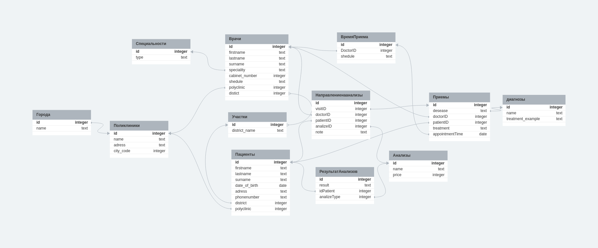

Пациенты {
id integer pk increments
firstname text
lastname text
surname text
date_of_birth date
adress text
phonenumber text
district integer > Участки.id
polyclinic integer > Поликлиники.id
}

диагнозы {
id integer pk increments
name text
treatment_example text
}

Анализы {
id integer pk increments
name text
price integer
}

Врачи {
id integer pk increments
firstname text
lastname text
surname text
speciality text > Специальности.id
cabinet_number integer
shedule text
polyclinic integer > Поликлиники.id
distict integer
}

Специальности {
id integer pk increments > Doctor.id
type text
}

Поликлиники {
id integer pk increments
name text
adress text
city_code integer
}

Города {
id integer pk increments > Поликлиники.id
name text
}

Участки {
id integer pk increments *>* Врачи.distict
district_name text
}

Приемы {
id integer pk increments
desease text > диагнозы.id
treatment text
doctorID integer > Врачи.id
patientID integer > Пациенты.id
}

Направлениенаанализы {
id integer pk increments
visitID integer > Приемы.id
doctorID integer > Врачи.id
patientID integer > Пациенты.id
analizeID integer > Анализы.id
note text
}
